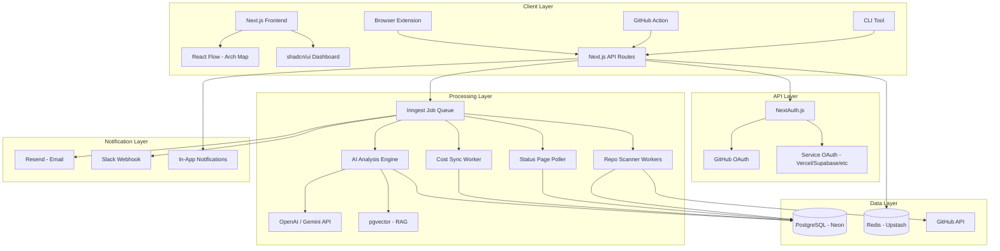

# ☁️ Cloudlens — Complete Project Roadmap

> **"A lens into every cloud service you use."**
>
> Cloudlens is a developer intelligence platform that explicitly asks for **read-only access to private repositories** to scan codebase files, detect third-party services, track costs, warn about expiring/forgotten services, and provide AI-powered recommendations — all from a single dashboard.

---

## 🎨 Brand Identity

| Element | Details |
|---|---|
| **Name** | Cloudlens |
| **Tagline** | *"A lens into every cloud service you use."* |
| **Domain** | `cloudlens.dev` (primary) / `cloudlens.io` (alt) |
| **Logo Concept** | Magnifying glass / lens icon with a cloud or `{ }` code bracket inside |
| **Primary Color** | Deep Indigo `#4F46E5` |
| **Accent Color** | Cyan `#06B6D4` |
| **Background** | Dark Slate `#0F172A` |
| **Text** | White `#F8FAFC` / Muted `#94A3B8` |
| **Typography** | Inter (headings) + JetBrains Mono (code/data) |
| **Brand Vibe** | Premium, developer-focused, dark mode, modern |

---

## 🏗️ Full Tech Stack

### Core Application

| Layer | Technology | Why |
|---|---|---|
| **Frontend** | Next.js 15 (App Router) + TypeScript | SSR, React Server Components, great DX |
| **Styling** | Tailwind CSS + shadcn/ui | Rapid premium UI, accessible components |
| **Auth** | NextAuth.js v5 (Auth.js) | GitHub OAuth built-in, extensible for service OAuth |
| **Database** | PostgreSQL (Neon) | Relational data, serverless-friendly, scales well |
| **ORM** | Drizzle ORM | Type-safe, lightweight, great with serverless |
| **Cache** | Redis (Upstash) | Serverless Redis for API response caching |
| **Job Queue** | Inngest | Event-driven, serverless-native async jobs |
| **Hosting** | Vercel (app) + Fly.io (workers) | Auto-scaling, edge-ready |
| **File Storage** | Cloudflare R2 | Store scan results, reports cheaply |

### AI Stack

| Component | Technology | Why |
|---|---|---|
| **LLM Provider** | OpenAI GPT-4o-mini / Gemini 2.0 Flash | Fast, cheap, great at code analysis |
| **AI Framework** | Vercel AI SDK | Streaming, structured output, multi-provider |
| **Embeddings** | OpenAI `text-embedding-3-small` | For semantic code search & service matching |
| **Vector Store** | pgvector (in Neon) | No extra infra — vectors inside existing Postgres |
| **RAG Pipeline** | LangChain.js (retrieval only) | For querying service documentation/policies |

### CLI & Extensions

| Component | Technology | Why |
|---|---|---|
| **CLI Tool** | Node.js + Commander.js | Familiar to JS devs, easy to publish on npm |
| **GitHub Action** | TypeScript Action | Native CI/CD integration |
| **Browser Extension** | Plasmo Framework | Cross-browser, React-based |

### Monitoring & Analytics

| Component | Technology | Why |
|---|---|---|
| **Error Tracking** | Sentry | Industry standard |
| **Analytics** | PostHog | Open-source, privacy-friendly |
| **Cron Jobs** | Vercel Cron + Inngest | Scheduled status checks, digest emails |
| **Email** | Resend | Developer-friendly transactional email |

---

## 📐 Complete Database Schema

```sql
-- ============ CORE ============
CREATE TABLE users (
  id UUID PRIMARY KEY DEFAULT gen_random_uuid(),
  github_id INTEGER UNIQUE NOT NULL,
  username VARCHAR(255) NOT NULL,
  email VARCHAR(255),
  avatar_url TEXT,
  github_access_token TEXT ENCRYPTED,
  plan ENUM('free', 'pro', 'team') DEFAULT 'free',
  created_at TIMESTAMPTZ DEFAULT NOW(),
  last_login_at TIMESTAMPTZ
);

CREATE TABLE organizations (
  id UUID PRIMARY KEY DEFAULT gen_random_uuid(),
  name VARCHAR(255) NOT NULL,
  owner_id UUID REFERENCES users(id),
  created_at TIMESTAMPTZ DEFAULT NOW()
);

CREATE TABLE org_members (
  org_id UUID REFERENCES organizations(id),
  user_id UUID REFERENCES users(id),
  role ENUM('owner', 'admin', 'member') DEFAULT 'member',
  PRIMARY KEY (org_id, user_id)
);

CREATE TABLE repositories (
  id UUID PRIMARY KEY DEFAULT gen_random_uuid(),
  user_id UUID REFERENCES users(id),
  org_id UUID REFERENCES organizations(id),
  github_repo_id INTEGER NOT NULL,
  name VARCHAR(255) NOT NULL,
  full_name VARCHAR(512) NOT NULL,
  is_private BOOLEAN DEFAULT false,
  default_branch VARCHAR(100) DEFAULT 'main',
  last_commit_at TIMESTAMPTZ,
  last_scanned_at TIMESTAMPTZ,
  scan_status ENUM('pending', 'scanning', 'completed', 'failed') DEFAULT 'pending',
  created_at TIMESTAMPTZ DEFAULT NOW()
);

-- ============ SERVICES ============
CREATE TABLE services (
  id UUID PRIMARY KEY DEFAULT gen_random_uuid(),
  name VARCHAR(255) NOT NULL,
  slug VARCHAR(100) UNIQUE NOT NULL,
  category ENUM('database', 'auth', 'hosting', 'storage', 'email', 'payments', 'analytics', 'cdn', 'monitoring', 'other'),
  logo_url TEXT,
  website_url TEXT,
  dashboard_url TEXT,         -- Direct link to login/dashboard
  status_page_url TEXT,       -- Public status page
  docs_url TEXT,
  -- Free tier policy info (for AI warnings)
  free_tier_limits JSONB,     -- {"inactivity_pause_days": 7, "bandwidth_gb": 100, ...}
  pricing_tiers JSONB,        -- [{"name": "free", "price": 0}, {"name": "pro", "price": 25}]
  created_at TIMESTAMPTZ DEFAULT NOW()
);

CREATE TABLE service_detection_rules (
  id UUID PRIMARY KEY DEFAULT gen_random_uuid(),
  service_id UUID REFERENCES services(id),
  rule_type ENUM('dependency', 'config_file', 'import_pattern', 'sdk_pattern', 'env_var', 'ci_cd', 'readme'),
  pattern TEXT NOT NULL,           -- regex or glob pattern
  file_glob TEXT,                  -- which files to check (e.g., "package.json")
  confidence_weight DECIMAL(3,2), -- 0.0 to 1.0
  language VARCHAR(50),            -- "javascript", "python", etc.
  created_at TIMESTAMPTZ DEFAULT NOW()
);

CREATE TABLE detected_services (
  id UUID PRIMARY KEY DEFAULT gen_random_uuid(),
  repo_id UUID REFERENCES repositories(id),
  service_id UUID REFERENCES services(id),
  confidence DECIMAL(3,2) NOT NULL, -- combined score 0.0-1.0
  detection_details JSONB,          -- [{"rule": "dependency", "match": "@supabase/supabase-js", "file": "package.json"}]
  first_detected_at TIMESTAMPTZ DEFAULT NOW(),
  last_seen_at TIMESTAMPTZ DEFAULT NOW(),
  status ENUM('active', 'inactive', 'unconfirmed') DEFAULT 'active',
  UNIQUE(repo_id, service_id)
);

-- ============ MONITORING & ALERTS ============
CREATE TABLE service_statuses (
  id UUID PRIMARY KEY DEFAULT gen_random_uuid(),
  service_id UUID REFERENCES services(id),
  status ENUM('operational', 'degraded', 'partial_outage', 'major_outage') NOT NULL,
  description TEXT,
  checked_at TIMESTAMPTZ DEFAULT NOW()
);

CREATE TABLE connected_accounts (
  id UUID PRIMARY KEY DEFAULT gen_random_uuid(),
  user_id UUID REFERENCES users(id),
  service_id UUID REFERENCES services(id),
  oauth_token TEXT ENCRYPTED,
  refresh_token TEXT ENCRYPTED,
  account_email VARCHAR(255),
  usage_data JSONB,              -- latest pulled usage metrics
  last_synced_at TIMESTAMPTZ,
  connected_at TIMESTAMPTZ DEFAULT NOW(),
  UNIQUE(user_id, service_id)
);

CREATE TABLE alerts (
  id UUID PRIMARY KEY DEFAULT gen_random_uuid(),
  user_id UUID REFERENCES users(id),
  repo_id UUID REFERENCES repositories(id),
  service_id UUID REFERENCES services(id),
  type ENUM('expiry_warning', 'inactivity', 'quota_limit', 'cost_spike', 'outage', 'security', 'ai_suggestion'),
  severity ENUM('info', 'warning', 'critical') DEFAULT 'info',
  title VARCHAR(500) NOT NULL,
  message TEXT NOT NULL,
  action_url TEXT,               -- direct link to service dashboard
  is_read BOOLEAN DEFAULT false,
  is_dismissed BOOLEAN DEFAULT false,
  created_at TIMESTAMPTZ DEFAULT NOW()
);

-- ============ COST TRACKING ============
CREATE TABLE cost_estimates (
  id UUID PRIMARY KEY DEFAULT gen_random_uuid(),
  user_id UUID REFERENCES users(id),
  service_id UUID REFERENCES services(id),
  repo_id UUID REFERENCES repositories(id),
  estimated_tier VARCHAR(50),       -- "free", "pro", "enterprise"
  estimated_monthly_cost DECIMAL(10,2),
  actual_monthly_cost DECIMAL(10,2), -- from connected account, if available
  currency VARCHAR(3) DEFAULT 'USD',
  month DATE NOT NULL,               -- first of the month
  source ENUM('estimated', 'api', 'manual') DEFAULT 'estimated',
  created_at TIMESTAMPTZ DEFAULT NOW()
);

-- ============ AI FEATURES ============
CREATE TABLE ai_insights (
  id UUID PRIMARY KEY DEFAULT gen_random_uuid(),
  user_id UUID REFERENCES users(id),
  type ENUM('migration', 'consolidation', 'security', 'optimization', 'recommendation'),
  title VARCHAR(500) NOT NULL,
  insight TEXT NOT NULL,
  affected_repos UUID[],
  affected_services UUID[],
  confidence DECIMAL(3,2),
  is_acted_on BOOLEAN DEFAULT false,
  created_at TIMESTAMPTZ DEFAULT NOW()
);

-- Vector embeddings for semantic service matching
CREATE TABLE service_embeddings (
  id UUID PRIMARY KEY DEFAULT gen_random_uuid(),
  service_id UUID REFERENCES services(id),
  content_type ENUM('description', 'docs', 'sdk_pattern'),
  content TEXT NOT NULL,
  embedding VECTOR(1536),  -- pgvector
  created_at TIMESTAMPTZ DEFAULT NOW()
);
```

---

## 🗺️ Phased Roadmap

### Phase 1 — MVP Core (Weeks 1–4)
**Goal:** GitHub login → scan repos → detect services → dashboard

```
Week 1: Foundation
├── Next.js project setup with TypeScript
├── GitHub OAuth with NextAuth.js (Configured for read-only private repo access)
├── Database schema + Drizzle ORM setup
├── Seed services table with 20 popular services
└── Basic dashboard layout (shadcn/ui)

Week 2: Detection Engine
├── GitHub API integration (fetch repos, file trees, file contents)
├── Build detection rule engine
│   ├── Dependency file parser (package.json, requirements.txt, go.mod)
│   ├── Config file detector (.firebaserc, vercel.json, supabase/)
│   ├── Import statement scanner (regex-based)
│   └── CI/CD config analyzer (.github/workflows/*.yml)
├── Confidence scoring system
└── Inngest job queue for async scanning

Week 3: Dashboard UI
├── Repo list with scan status
├── Service inventory grid (grouped by repo)
├── Service detail cards (name, logo, category, confidence, dashboard link)
├── Quick filters (by service, by repo, by category)
└── "Scan Now" button + real-time scan progress

Week 4: Polish & Deploy
├── Responsive design
├── Loading states, error boundaries
├── Rate limiting for GitHub API
├── Deploy to Vercel + set up CI/CD
└── Landing page
```

---

### Phase 2 — Smart Alerts & Warnings (Weeks 5–8)
**Goal:** Proactive warnings about expiring/forgotten/at-risk services

```
Alert System:
├── Inactivity alerts
│   ├── Cross-reference last_commit_at with service free tier policies
│   ├── "Supabase pauses after 7 days inactivity — your repo is idle for 3 months"
│   └── "Neon suspends compute after 5 min idle — still need this DB?"
│
├── Quota/limit warnings
│   ├── For connected accounts: pull real usage via APIs
│   ├── For unconnected: estimate based on repo activity + known limits
│   └── "Vercel hobby: 100GB bandwidth — you're at 82%"
│
├── Expiry warnings
│   ├── User-set trial end dates ("Firebase Blaze trial ends March 30")
│   ├── Known free tier time limits
│   └── Subscription renewal reminders (from connected accounts)
│
├── Service outage alerts
│   ├── Poll public status pages (Atlassian Statuspage API)
│   ├── RSS feed monitoring
│   └── "⚠️ Supabase is experiencing degraded performance — Status Page"
│
├── Alert delivery
│   ├── In-app notification center (bell icon + badge count)
│   ├── Email digest (daily/weekly, configurable)
│   └── Slack webhook integration
│
└── Alert actions
    ├── Each alert has a direct "→ Go to Dashboard" link
    ├── "Dismiss" / "Snooze for 7 days" / "Mark as resolved"
    └── "I cancelled this service" → removes from active tracking
```

**Cron Jobs (Inngest scheduled functions):**
```
├── Every 5 min  → Check service status pages
├── Every hour   → Sync connected account usage data
├── Every day    → Check repo inactivity against service policies
├── Every week   → Generate weekly digest email
└── Every month  → Generate cost report
```

---

### Phase 3 — AI-Powered Intelligence (Weeks 9–12)
**Goal:** Transform from a dashboard into an intelligent advisor

#### 3A: AI Service Detection Enhancement

```typescript
// Use LLM to catch services that regex-based rules miss
async function aiEnhancedDetection(repoFiles: FileTree) {
  const prompt = `
    Analyze these project files and identify ALL third-party services being used.
    Look for: SDKs, API calls, config files, environment variables, deployment targets.
    
    Files: ${JSON.stringify(repoFiles)}
    
    Return JSON: [{ service: string, evidence: string, confidence: number }]
  `;
  
  // Use structured output with Vercel AI SDK
  const { object } = await generateObject({
    model: openai('gpt-4o-mini'),
    schema: serviceDetectionSchema,
    prompt
  });
  
  return object.services;
}
```

**When AI runs:** Only when regex-based detection finds < 2 services (likely missing something), or on user-triggered "Deep Scan".

#### 3B: Smart Recommendations Engine

| Recommendation Type | AI Prompt Strategy | Example Output |
|---|---|---|
| **Missing services** | Analyze detected stack → suggest gaps | *"You have a DB but no auth. Consider Supabase Auth or Clerk."* |
| **Consolidation** | Find duplicate service categories | *"You use Supabase in 2 repos and Neon in 1. Consolidate to save $25/mo."* |
| **Migration paths** | Compare service features + pricing | *"Consider migrating from Firebase to Supabase — similar features, lower cost."* |
| **Security** | Scan for exposed keys/patterns | *"API key found in `config.ts` — move to environment variables."* |
| **Cost optimization** | Analyze usage vs tier | *"Your Vercel Pro usage fits the hobby plan. Downgrade to save $20/mo."* |

```typescript
// Weekly AI analysis job
async function generateInsights(userId: string) {
  const context = await buildUserContext(userId);
  // context includes: all repos, detected services, costs, activity levels
  
  const { object } = await generateObject({
    model: openai('gpt-4o-mini'),
    schema: insightsSchema,
    system: `You are a cloud services advisor for developers. 
             Analyze their service usage and provide actionable insights.
             Focus on: cost savings, security risks, unused services, and better alternatives.`,
    prompt: `User context: ${JSON.stringify(context)}`
  });
  
  // Store insights and create alerts for high-priority ones
  await storeInsights(userId, object.insights);
}
```

#### 3C: RAG for Service Policies

```
Pipeline:
1. Scrape/store documentation for each service's free tier limits, pricing, policies
2. Chunk and embed with text-embedding-3-small → store in pgvector
3. When generating alerts/insights, retrieve relevant policy docs
4. LLM generates accurate, policy-aware recommendations

Example query flow:
  User has Supabase detected + repo inactive 5 days
  → RAG retrieves: "Supabase free tier pauses projects after 7 days of inactivity"
  → AI generates: "⚠️ Your Supabase project will pause in 2 days. Push a commit or visit dashboard."
```

**AI Cost Estimation:** ~$0.002/scan (GPT-4o-mini), ~$0.0001/embedding. At 10K users × 10 repos = very affordable.

---

### Phase 4 — Visual Architecture Map (Weeks 13–15)
**Goal:** Auto-generate interactive service dependency diagrams

```
Detection logic:
1. Parse imports/requires to build dependency graph
2. Map dependencies to detected services
3. Identify connections:
   - Next.js app → deployed on Vercel (vercel.json)
   - App imports Supabase client → backend is Supabase
   - App imports Stripe → payment processing
   - GitHub Actions → CI/CD on GitHub

Rendering:
├── React Flow (interactive node-based diagrams)
├── Auto-layout with dagre algorithm
├── Each node = service card (icon, name, status indicator)
├── Click node → side panel with details, link to dashboard
├── Color coding: 🟢 healthy | 🟡 warning | 🔴 issue
└── Export as PNG/SVG for sharing
```

---

### Phase 5 — CLI Scanner & GitHub Action (Weeks 16–18)
**Goal:** Catch `.env` secrets and integrate into CI/CD

```bash
# CLI Installation & Usage
npm install -g @cloudlens/cli

# Scan current directory (catches .env files GitHub can't see)
cloudlens scan .
# Output:
# ☁️ Cloudlens — Scanning local project...
# Found in .env:
#   SUPABASE_URL → Supabase detected
#   STRIPE_SECRET_KEY → Stripe detected ⚠️ LIVE KEY
# Found in package.json:
#   @supabase/supabase-js → Supabase (confirmed)
# 📤 Synced to cloudlens.dev/dashboard

# Sync to cloud dashboard
cloudlens sync --token <API_TOKEN>

# Check all services status
cloudlens status
```

```yaml
# GitHub Action — .github/workflows/cloudlens.yml
name: Cloudlens Scan
on: [push, pull_request]
jobs:
  scan:
    runs-on: ubuntu-latest
    steps:
      - uses: actions/checkout@v4
      - uses: cloudlens/action@v1
        with:
          token: ${{ secrets.CLOUDLENS_TOKEN }}
          # Comments on PRs when new services are detected
          comment-on-pr: true
          # Fails PR if unapproved services are added (team feature)
          enforce-policy: false
```

---

### Phase 6 — Cost Tracker & Developer Burn Rate (Weeks 19–22)
**Goal:** Unified cost visibility across all services

```
Cost Dashboard:
├── Monthly cost breakdown by service (bar chart)
├── Cost trend over time (line chart)
├── "Burn rate" — total monthly spend with MoM change
├── Per-repo cost attribution
├── AI-generated savings suggestions
│   └── "Switch repo-x from Supabase Pro to free tier — only 200 rows in DB"
├── Budget alerts — "You're projected to exceed $50/mo this month"
└── Cost comparison tool — "Supabase Pro vs Neon Pro vs PlanetScale"

Data sources:
├── Connected accounts → real billing data (best)
├── Detected tier + known pricing → estimated cost (good)
└── User-entered costs → manual input (fallback)
```

---

### Phase 7 — Teams, Gamification & Scale (Weeks 23–28)
**Goal:** B2B features and viral growth

```
Team Features:
├── Org-wide service inventory
├── Role-based access (owner, admin, member)
├── Service ownership tagging ("Who set up this Firebase?")
├── Offboarding checklist — developer leaves → list services to revoke
├── Policy enforcement — whitelist/blacklist services
├── Audit log — who added/removed services when
└── SSO (SAML) for enterprise

Gamification:
├── Health score (0-100) — based on unused services, security, cost efficiency
├── Badges — "Clean Stack" (no unused services), "Money Saver" ($50+ saved)
├── Shareable profile cards (like GitHub contribution graph)
└── Leaderboard for teams

Weekly Digest Email:
├── 🔴 Action needed (expiring, at-risk)
├── ⚠️ Heads up (approaching limits)
├── ✅ All good (healthy services)
├── 💡 AI tip of the week
└── 📊 Cost summary
```

---

## 🧠 AI Implementation Summary

| Where AI is Used | Model | Trigger | Cost/Call |
|---|---|---|---|
| Enhanced service detection | GPT-4o-mini | When basic rules find < 2 services | ~$0.002 |
| Smart recommendations | GPT-4o-mini | Weekly cron per user | ~$0.005 |
| Security scanning | GPT-4o-mini | On each scan | ~$0.001 |
| Cost optimization tips | GPT-4o-mini | Monthly per user | ~$0.003 |
| Service policy RAG | Embeddings + GPT-4o-mini | When generating warnings | ~$0.001 |
| PR comment generation | GPT-4o-mini | On GitHub Action trigger | ~$0.001 |

**Monthly AI cost at 10K users:** ~$150–300/mo — very sustainable.

> [!TIP]
> Start with GPT-4o-mini for everything. Switch to Gemini 2.0 Flash for even lower cost at scale. The Vercel AI SDK makes switching providers a one-line change.

---

## 📊 Complete Architecture



---

## 💰 Updated Monetization

| Tier | Price | Includes |
|---|---|---|
| **Free** | $0 | 5 repos, basic detection, 1 connected service, weekly digest |
| **Pro** | $12/mo | Unlimited repos, AI insights, cost tracking, all alerts, CLI access |
| **Team** | $24/user/mo | Org features, offboarding, policy enforcement, audit logs, SSO |
| **Enterprise** | Custom | On-prem scanner, custom integrations, SLA, dedicated support |

---

## ⏱️ Timeline Summary

| Phase | Weeks | What You Get |
|---|---|---|
| **1. MVP Core** | 1–4 | GitHub login, repo scanning, service detection, dashboard |
| **2. Smart Alerts** | 5–8 | Expiry warnings, inactivity alerts, email digests, status monitoring |
| **3. AI Intelligence** | 9–12 | Smart recommendations, security scan, enhanced detection |
| **4. Architecture Map** | 13–15 | Interactive visual diagrams of service dependencies |
| **5. CLI + GitHub Action** | 16–18 | Local scanning, CI/CD integration, PR comments |
| **6. Cost Tracker** | 19–22 | Burn rate dashboard, savings suggestions, budget alerts |
| **7. Teams + Scale** | 23–28 | Org support, gamification, offboarding, enterprise features |

**Cloudlens MVP to production: ~4 weeks. Full platform: ~7 months.**

---

> Built with 🔍 by the Cloudlens team — *"A lens into every cloud service you use."*
